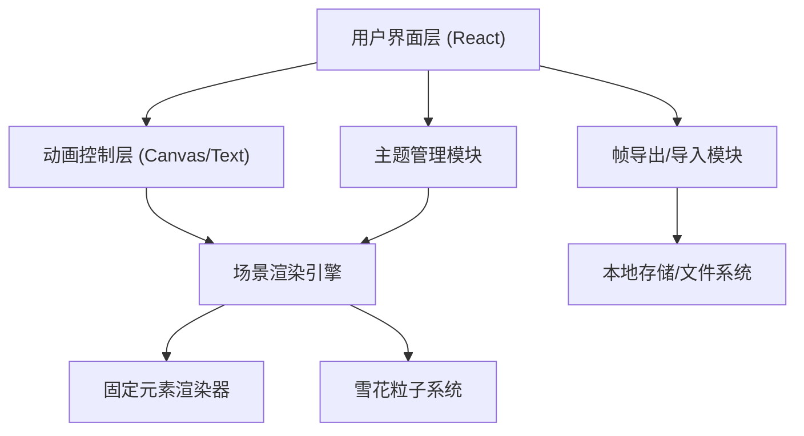

## 1. 架构设计



## 2. 技术描述

- **前端**：React@18 + TypeScript + tailwindcss@3 + vite
- **初始化工具**：vite-init
- **后端**：无（纯前端应用）
- **数据库**：无（使用 localStorage 临时存储）
- **动画引擎**：requestAnimationFrame + 自定义字符渲染器

### 核心技术选型理由
1. **React**：组件化开发，便于管理 UI 状态和动画循环
2. **TypeScript**：类型安全，确保主题数据和帧数据结构正确
3. **TailwindCSS**：快速实现响应式布局和玻璃拟态风格
4. **纯字符渲染**：使用 `<pre>` 标签渲染字符画布，无需 Canvas，兼容性更好
5. **requestAnimationFrame**：实现流畅的 60fps 动画

## 3. 目录结构

```
src/
├── components/
│   ├── CardCanvas.tsx      # 字符贺卡画布组件
│   ├── ThemeSelector.tsx   # 主题选择器
│   ├── ControlPanel.tsx    # 控制面板
│   ├── ExportModal.tsx     # 导出弹窗
│   └── ImportModal.tsx     # 导入弹窗
├── engine/
│   ├── types.ts            # 类型定义
│   ├── themes.ts           # 主题配置数据
│   ├── scene.ts            # 场景渲染引擎
│   ├── snowflakes.ts       # 雪花粒子系统
│   └── frames.ts           # 帧管理（导出/导入）
├── hooks/
│   └── useAnimationLoop.ts # 动画循环 Hook
├── App.tsx
├── main.tsx
└── index.css
```

## 4. 核心数据结构

### 4.1 主题配置

```typescript
interface Theme {
  id: string;
  name: string;
  icon: string;
  colors: {
    background: string;
    snowflake: string;
    roof: string;
    lamp: string;
    lampLight: string;
    text: string;
    accent: string;
  };
  scene: {
    roof: string[];
    lamp: string[];
    greeting: string[];
  };
}
```

### 4.2 雪花粒子

```typescript
interface Snowflake {
  x: number;
  y: number;
  speed: number;
  sway: number;
  char: string;
  opacity: number;
}
```

### 4.3 帧数据

```typescript
interface FrameData {
  version: string;
  themeId: string;
  fps: number;
  frameCount: number;
  width: number;
  height: number;
  frames: string[];  // 每一帧的字符串数组
}
```

## 5. 核心模块设计

### 5.1 场景渲染引擎 (scene.ts)
- 负责将固定元素（屋顶、路灯、祝福语）渲染到字符画布
- 管理画布尺寸（60x30）
- 支持主题切换时的元素更新

### 5.2 雪花粒子系统 (snowflakes.ts)
- 管理雪花粒子池（约 50-80 个雪花）
- 每帧更新雪花位置（下落 + 摇摆）
- 回收超出边界的雪花并重新生成

### 5.3 帧管理模块 (frames.ts)
- 捕获渲染帧并存储
- 支持导出 JSON 格式的帧数据
- 支持导入帧数据并按帧率回放

### 5.4 动画循环 Hook (useAnimationLoop.ts)
- 封装 requestAnimationFrame
- 支持暂停/播放、速度调节
- 自动清理避免内存泄漏

## 6. 主题配置数据

三种主题的字符艺术设计：

### 平安夜主题
- 屋顶：积雪覆盖的房屋轮廓
- 路灯：发光的街灯
- 祝福语："平安夜快乐" / "Merry Christmas Eve"

### 生日主题
- 屋顶：带气球的屋顶
- 路灯：彩灯装饰
- 祝福语："生日快乐" / "Happy Birthday"

### 新年主题
- 屋顶：挂灯笼的屋顶
- 路灯：烟花效果
- 祝福语："新年快乐" / "Happy New Year"

## 7. 性能优化

- **粒子池复用**：雪花对象循环使用，避免频繁 GC
- **按需渲染**：仅在动画播放时更新
- **节流导出**：导出时限制帧率（15fps），减少数据量
- **虚拟列表**：回放时按需渲染帧，避免内存溢出
