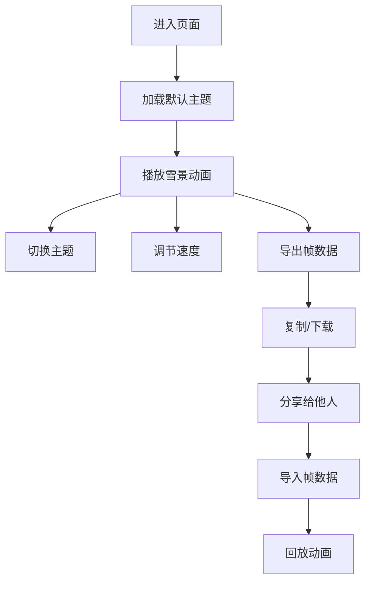

## 1. 产品概述

字符雪景贺卡是一款基于 ASCII 字符艺术的互动式节日贺卡生成器，用户可以选择不同主题（平安夜、生日、新年），观看雪花缓缓飘落的动画效果，并支持导出动画帧进行回放分享。

- 主要用途：为用户提供创意节日祝福方式，通过字符艺术呈现独特的雪景贺卡
- 目标用户：喜欢创意设计、节日祝福分享的用户群体
- 产品价值：将传统节日贺卡与字符艺术结合，提供可交互、可导出分享的全新祝福体验

## 2. 核心功能

### 2.1 用户角色
无用户角色区分，所有功能对访客开放。

### 2.2 功能模块
1. **主页面**：贺卡预览区域、主题选择面板、控制面板
2. **贺卡动画区**：字符雪景动画展示（屋顶、路灯、祝福语固定，雪花飘落）
3. **主题切换**：平安夜、生日、新年三种主题切换
4. **帧导出与回放**：导出当前动画帧序列，支持重新播放

### 2.3 页面详情

| 页面名称 | 模块名称 | 功能描述 |
|---------|---------|---------|
| 主页面 | 贺卡预览区 | 60x30 字符画布，实时渲染雪景动画 |
| 主页面 | 主题选择面板 | 三个主题按钮，点击切换贺卡内容和配色 |
| 主页面 | 控制面板 | 播放/暂停、速度调节、导出帧、导入回放按钮 |
| 主页面 | 导出弹窗 | 显示导出的帧数据，提供复制和下载功能 |
| 主页面 | 导入弹窗 | 粘贴帧数据进行回放 |

## 3. 核心流程

用户进入页面 → 默认加载平安夜主题 → 观看雪花飘落动画 → 可切换主题 → 可调节播放速度 → 点击导出获取帧数据 → 分享给他人 → 他人导入帧数据回放

## 4. 用户界面设计

### 4.1 设计风格
- **主色调**：深邃夜空蓝 (#0a1628) 作为背景，搭配各主题专属配色
- **主题配色**：
  - 平安夜：暖黄色 (#ffd700) 灯光 + 白色 (#ffffff) 雪花 + 红色 (#dc143c) 装饰
  - 生日：粉色 (#ff69b4) 气球 + 金色 (#ffd700) 彩带 + 彩色文字
  - 新年：金色 (#ffd700) 灯笼 + 红色 (#dc143c) 装饰 + 白色雪花
- **按钮样式**：圆角玻璃拟态按钮，带微光悬停效果
- **字体**：等宽字体 `JetBrains Mono` 或 `Courier New` 确保字符对齐
- **布局风格**：居中卡片式布局，动画区为视觉焦点，控制面板位于底部
- **字符艺术**：使用 `*`、`❄`、`+`、`.` 等字符绘制场景元素

### 4.2 页面设计概述

| 页面名称 | 模块名称 | UI 元素 |
|---------|---------|---------|
| 主页面 | 贺卡预览区 | 字符画布、固定元素（屋顶/路灯/祝福语）、飘落雪花、主题背景色 |
| 主页面 | 主题选择面板 | 三个主题按钮（带图标）、当前主题高亮 |
| 主页面 | 控制面板 | 播放/暂停按钮、速度滑块、导出按钮、导入按钮 |
| 主页面 | 弹窗 | 半透明背景、圆角弹窗、文本区域、操作按钮 |

### 4.3 动画效果
- **雪花飘落**：每帧更新雪花位置，速度随机，飘落路径带轻微摇摆
- **主题切换**：渐隐渐现过渡效果
- **按钮交互**：悬停时微光扩散，点击时轻微缩放
- **文字闪烁**：祝福语区域呼吸灯效果

### 4.4 响应式
- 桌面端优先设计，字符画布固定 60x30
- 移动端自适应缩放，保持画布比例
- 触摸设备优化按钮尺寸，确保可点击区域充足
